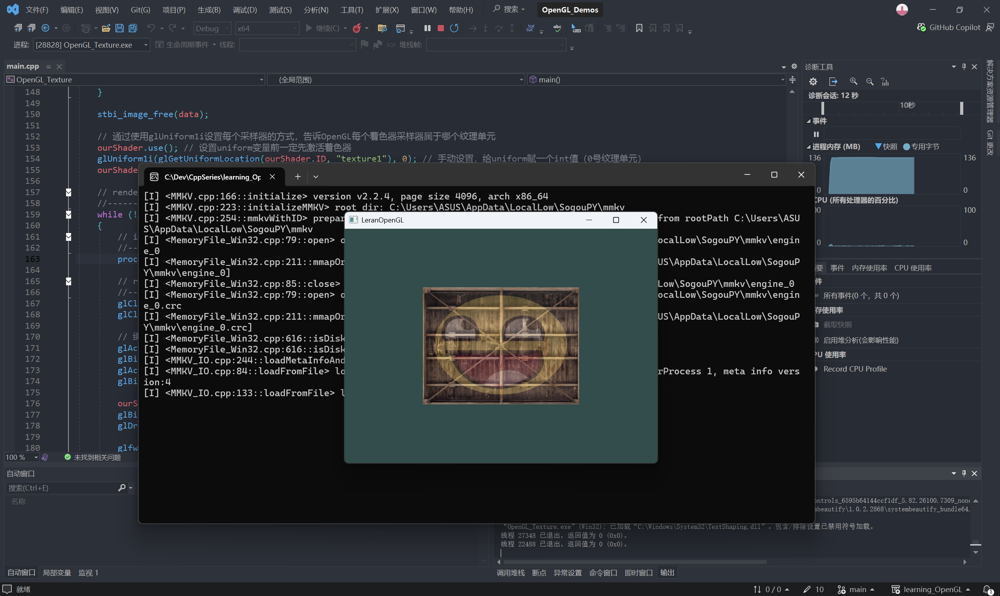

## 02_OpenGL_Texture Demo

这个demo对应LearnOpenGL CN 中的纹理章节

### 主要内容
- 使用stb_image加载纹理
- 纹理环绕与过滤方式
- 结合基础着色器管线

### 效果呈现

<p align="center">
  
</p>


### build
```bash
git clone https://github.com/HYChyc-ai/Graphics_Engineer_Portfolio.git
cd Graphics_Engineer_Portfolio
mkdir build && cd build
cmake ..
