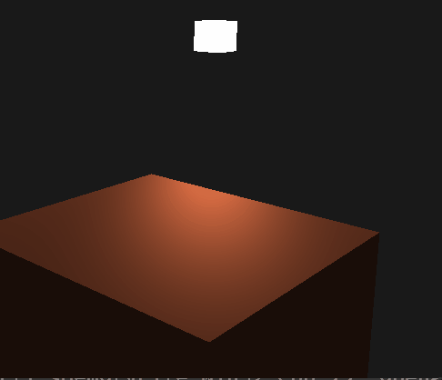

## 04_OpenGL_Light

这是一个基于 **OpenGL 3.3 core** 的学习型 Demo，参照 LearnOpenGL CN 2.1和2.2节
该demo在片段着色器中将光照拆分为  **环境光（Ambient） / 漫反射（Diffuse） / 镜面反射（Specular）** 三个部分分别计算，  最后进行叠加，得到最终片段颜色。

### 主要内容
- 环境光照、漫反射光以及镜面反射光的计算
- 风氏光照模型的实现与应用
- 法线计算和标准化
- 材质与光照结构体
- 三种分量与材质和光照的关系

---

### Demo效果预览

<p align="center">
  
</p>

>> 场景中包括一个立方体和一个光源，演示了不同的光照效果：  
> - 立方体表面应用了环境光、漫反射光和镜面光照
> - 展现特定的物体材质与光的属性
> - 观察者视角动态调整，观察物体在不同光照下的颜色输出

---

## 核心实现说明

### 1. 环境光
```glsl
vec3 ambient = material.ambient * light.ambient;
```
- 与光照方向和视角无关，仅提供基础亮度
- 通过 材质属性 × 光源属性 的方式体现不同材质对环境光的反射差异

### 2. 漫反射光
```glsl
vec3 norm = normalize(Normal);
vec3 lightDir = normalize(lightPos - FragPos);
float diff = max(dot(norm, lightDir), 0.0);
vec3 diffuse = (diff * material.diffuse) * light.diffuse;
```
- 使用法线向量与光照方向的点乘计算光照强度
- 点乘结果反映光线与表面的夹角关系

### 3. 镜面反射光照
```glsl
vec3 viewDir = normalize(viewPos - FragPos);
vec3 reflectDir = reflect(-lightDir, norm);
float spec = pow(max(dot(viewDir, reflectDir), 0.0), material.shininess);
vec3 specular = (material.specular * spec) * light.specular;
```

- 通过反射向量与视线方向计算高光强度
- 使用 shininess 控制高光的集中程度（反光度）
- 与观察者位置相关，用于模拟物体表面的反光效果

### 4. 着色器部分
- 顶点着色器处理法线、物体位置和光源信息
- 片段着色器计算环境光、漫反射光以及镜面反射光
- 结果颜色通过 `FragColor` 输出到渲染管线


---

## 基础交互说明（示例）

- **W / A / S / D**：前后左右移动摄像机  
- **鼠标移动**：控制视角方向  
- **滚轮**：缩放视野（FOV）

---

## 使用的技术栈

- **OpenGL 3.3 Core Profile**
- **GLFW**
- **GLAD**
- **GLM**

---

### build
```bash
git clone https://github.com/HYChyc-ai/Graphics_Engineer_Portfolio.git
cd Graphics_Engineer_Portfolio
mkdir build && cd build
cmake ..
